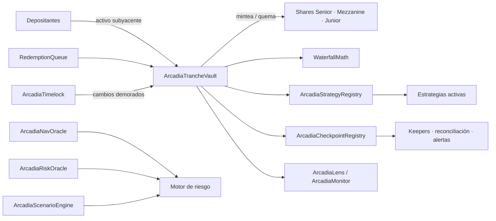
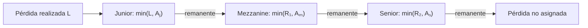

# ArcadiaTrancheProtocol


[](https://github.com/SolguardLabs/ArcadiaTrancheProtocol/actions/workflows/ci.yml)
[](https://docs.soliditylang.org/)
[](https://book.getfoundry.sh/)
[](./LICENSE)

Arcadia es una infraestructura de crédito estructurado on-chain que agrupa un activo de
liquidación y distribuye capital, rendimiento y pérdidas entre tres niveles de prioridad:
`Senior`, `Mezzanine` y `Junior`. El sistema separa el libro contable del vault, la custodia de
shares, la asignación matemática, el riesgo, las estrategias, la gobernanza y la observabilidad.

La versión `1.0.0` incorpora un motor determinista de escenarios, evidencias contables
encadenadas, límites de flujo diarios, fuentes NAV con heartbeat, registro de deuda por estrategia,
cola de redenciones y ejecución administrativa con timelock.

## Arquitectura



| Capa | Componentes | Responsabilidad |
| --- | --- | --- |
| Capital | `ArcadiaTrancheVault`, `TrancheShareToken` | Custodia, books, depósitos y redenciones |
| Matemática | `WaterfallMath`, `FixedPointMath` | Precios, shares, waterfall de ingresos y pérdidas |
| Riesgo | `ArcadiaRiskOracle`, `ArcadiaNavOracle`, `ArcadiaScenarioEngine` | Bandas, observaciones frescas y stress testing |
| Estrategia | `ArcadiaStrategyRegistry`, `ArcadiaBufferedStrategy` | Límites de deuda, liquidez y reconciliación |
| Operación | `RedemptionQueue`, `TrancheParameterStore`, `ReserveLedger` | Ventanas de salida, límites diarios y reservas |
| Control | `ArcadiaTimelock`, `ArcadiaCheckpointRegistry` | Gobernanza diferida y trazabilidad del estado |
| Lectura | `ArcadiaLens`, `ArcadiaMonitor` | Snapshots agregados, cobertura y salud operativa |

La descripción completa de límites y relaciones está en
[Arquitectura](./docs/arquitectura.md).

## Modelo económico

Cada tranche mantiene activos contabilizados `Aᵢ`, shares `Sᵢ` y precios independientes de entrada
y salida. Con precisión WAD:

```text
sharesEmitidas = activosDepositados × 1e18 / precioEntrada
activosEntregados = sharesQuemadas × precioSalida / 1e18
```

Las pérdidas realizadas recorren el capital en orden inverso a su prioridad:



En sentido contrario, un harvest neto cubre primero el objetivo Senior, después el objetivo
Mezzanine y entrega el residual a Junior. El contrato registra los importes realizados y conserva
una separación explícita entre precio de entrada, precio de salida y precio de liquidación.

El [modelo económico](./docs/modelo-economico.md) incluye las ecuaciones, un ejemplo numérico
completo y el cálculo del score de estrés.

## Ciclo operativo

1. El usuario aprueba el activo y ejecuta `deposit(tranche, assets, receiver)`.
2. El vault valida pausas, configuración y cap antes de emitir shares.
3. Los keepers registran ingresos realizados con `harvest(amount, sourceHash)`.
4. Los reporters autorizados reflejan pérdidas realizadas mediante reportes reconciliables.
5. Las salidas directas verifican shares, allowance, precio y liquidez disponible.
6. La cola opcional reserva capacidad del propietario, aplica un retardo mínimo y conserva su
   mínimo de activos.
7. Keepers y operadores comparan snapshots, NAV y checkpoints antes de cada cierre operativo.
8. Los cambios sensibles se programan y ejecutan a través de `ArcadiaTimelock`.

Consulta el [runbook operativo](./docs/operacion.md) para los estados normales, de degradación y
emergencia.

## Motor de escenarios

`ArcadiaScenarioEngine.assess` evalúa cinco entradas acotadas a 10.000 bps: pérdida bruta,
haircut de liquidez, correlación, concentración y buffer líquido mínimo. Devuelve asignación por
tranche, liquidez estresada, déficit, cobertura Senior, score, nivel de riesgo y un digest
reproducible.

```solidity
ArcadiaScenarioEngine.Shock memory shock = ArcadiaScenarioEngine.Shock({
    lossBps: 2_500,
    liquidityHaircutBps: 3_000,
    correlationBps: 4_000,
    concentrationBps: 3_500,
    minimumLiquidBufferBps: 5_000
});

ArcadiaScenarioEngine.ScenarioResult memory result = engine.assess(portfolio, shock);
```

El score combina pérdida (35 %), liquidez (25 %), correlación (20 %) y concentración (20 %).
Una pérdida asignada a Senior fuerza el nivel `Restricted`, con independencia del score agregado.

## Puesta en marcha

Requisitos:

- Foundry `1.7.1` o posterior compatible.
- Solidity `0.8.24`.
- Bash para los scripts de validación.

```bash
git clone https://github.com/SolguardLabs/ArcadiaTrancheProtocol.git
cd ArcadiaTrancheProtocol
cp .env.example .env
bash scripts/bootstrap.sh
forge build --sizes
forge test
```

Validación equivalente a CI:

```bash
bash scripts/ci.sh
```

Despliegue preparado, después de completar y revisar `.env`:

```bash
source .env
forge script script/DeployArcadia.s.sol:DeployArcadia \
  --rpc-url "$RPC_URL" --broadcast --verify
```

No se incluyen direcciones de red predefinidas. La [guía de despliegue](./docs/despliegue.md)
define precondiciones, roles, orden de configuración y validaciones posteriores.

## Documentación

- [Arquitectura y fronteras de confianza](./docs/arquitectura.md)
- [Modelo económico y escenarios](./docs/modelo-economico.md)
- [Runbook de operación](./docs/operacion.md)
- [Despliegue y configuración](./docs/despliegue.md)
- [Observabilidad y reconciliación](./docs/observabilidad.md)
- [Política de seguridad](./SECURITY.md)

## Estado de versión

La rama `main` representa la línea estable. La rama `production` apunta al commit publicado. Los
tags `vMAJOR.MINOR.PATCH` son anotados y su release contiene las notas de entrega correspondientes.

## Licencia

[MIT](./LICENSE).
