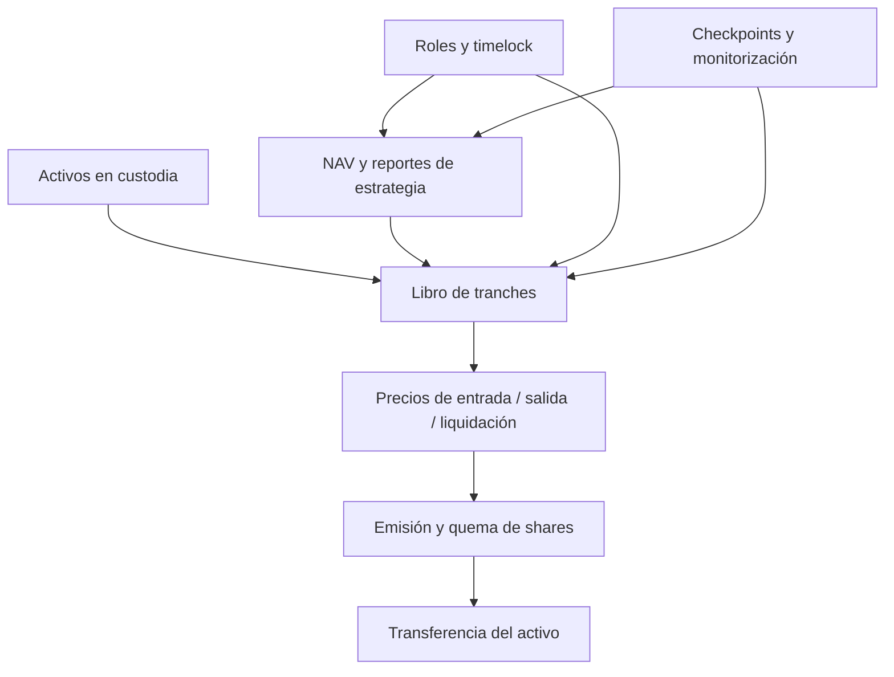

# Política de seguridad

Arcadia trata la contabilidad de capital, la prioridad entre tranches y la autoridad operativa como
fronteras críticas. Esta política define las versiones atendidas, el canal de comunicación y la
información mínima necesaria para investigar un comportamiento no esperado.

## Versiones atendidas

| Versión | Estado | Actualizaciones de seguridad |
| --- | --- | --- |
| `1.0.x` | Producción | Sí |
| `< 1.0.0` | No mantenida | No |

## Canal privado

Utiliza **Security → Private security advisory** en GitHub para abrir un aviso privado. No
publiques detalles técnicos en issues, discussions, pull requests ni redes sociales antes de que el
equipo confirme la coordinación.

El aviso debe contener:

- commit, tag y red donde se observó el comportamiento;
- contrato, función y rol involucrados;
- precondiciones y secuencia mínima de transacciones;
- valores de entrada, estado previo y estado resultante;
- impacto contable o económico cuantificado;
- prueba reproducible sin credenciales ni datos de terceros;
- propuesta de contención, si existe.

Se acusará recibo en un máximo objetivo de 72 horas. La clasificación, la ventana de corrección y
la publicación coordinada dependen de reproducibilidad, alcance e impacto.

## Fronteras críticas



Los siguientes invariantes tienen prioridad de revisión:

1. `totalAccountedAssets` coincide con la suma de los books de las tres tranches.
2. Ninguna salida entrega más activo que el permitido por shares, precio y liquidez.
3. Las pérdidas se asignan Junior → Mezzanine → Senior.
4. Un reporte, observación o checkpoint no se acepta como fresco si nunca fue inicializado.
5. La deuda de una estrategia no supera su límite ni se contabiliza si está inactiva.
6. Los cambios administrativos diferidos respetan delay, predecessor y grace period.
7. Los tokens con comportamiento no estándar no alteran silenciosamente el book.
8. La ejecución de emergencia usa precio de liquidación y permisos específicos.

## Modelo de roles

| Rol | Facultades | Separación recomendada |
| --- | --- | --- |
| `DEFAULT_ADMIN_ROLE` | Gestión de roles | Multisig de máxima seguridad |
| `GOVERNOR_ROLE` | Programa cambios | Multisig de gobernanza |
| `GUARDIAN_ROLE` | Pausas y cancelaciones | Multisig operativo independiente |
| `KEEPER_ROLE` | Harvests, cierres y checkpoints | Automatización limitada |
| `REPORTER_ROLE` | Reportes de pérdidas | Servicio de reconciliación |
| `STRATEGIST_ROLE` | Configura estrategias | Comité de asignación |
| `RISK_MANAGER_ROLE` | Bandas, límites y fuentes | Comité de riesgo |

No se recomienda concentrar `DEFAULT_ADMIN_ROLE`, `KEEPER_ROLE` y `REPORTER_ROLE` en la misma
clave. La transferencia de autoridad debe verificarse on-chain antes de retirar los permisos del
desplegador.

## Exclusiones operativas

No se procesarán avisos que requieran credenciales obtenidas de terceros, denegación de servicio
contra infraestructura ajena, spam, ingeniería social o interacción con cuentas que no pertenezcan
al remitente. No envíes activos ni ejecutes acciones irreversibles para demostrar un impacto.

## Validación del repositorio

```bash
forge fmt --check
forge build --sizes
forge test
FOUNDRY_PROFILE=ci forge test -vvv
```

Los controles operativos adicionales están documentados en
[docs/operacion.md](./docs/operacion.md) y
[docs/observabilidad.md](./docs/observabilidad.md).
