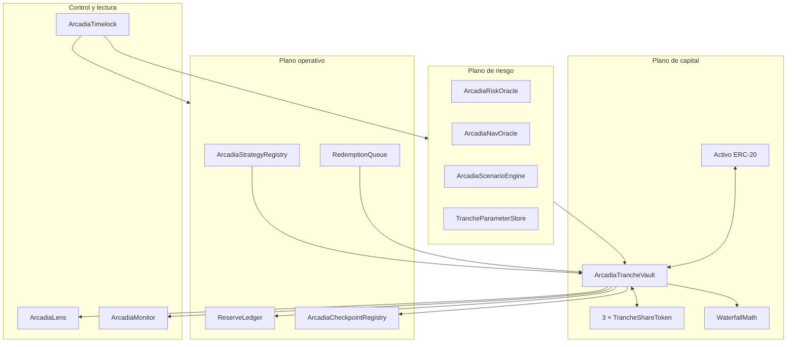
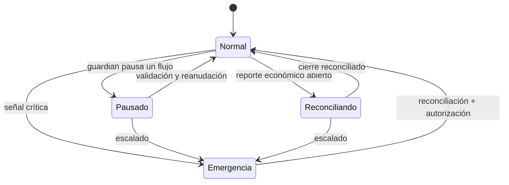

# Arquitectura y fronteras de confianza

## Objetivo

Arcadia divide un mismo activo de liquidación en tres libros de prioridad. El vault es la única
fuente autoritativa para activos contabilizados, shares y precios de tranche; los módulos auxiliares
aportan políticas, evidencias y lecturas, pero no deben reescribir el book por su cuenta.

## Componentes



### Vault y shares

`ArcadiaTrancheVault` crea un token de share por tranche y conserva su dirección de forma
inmutable. Cada depósito mide la variación real del balance del activo para rechazar tokens que no
transfieran el importe solicitado. Las redenciones queman shares antes de transferir y están
protegidas contra reentrada.

### Matemática

`FixedPointMath` centraliza WAD, bps, multiplicación-división y restas con suelo cero.
`WaterfallMath` implementa funciones puras para mantener la lógica económica aislada del estado y
facilitar pruebas diferenciales.

### Datos de riesgo

- `ArcadiaRiskOracle`: bandas por tranche, cobertura mínima y observaciones de precio.
- `ArcadiaNavOracle`: catálogo de fuentes, reporter, confianza mínima y heartbeat.
- `ArcadiaScenarioEngine`: evaluación pura; no modifica el vault.
- `TrancheParameterStore`: límites de operación y buckets diarios de entrada/salida.

Una observación no inicializada nunca se considera fresca. Los consumidores deben usar
`requireFresh` o `requireFreshObservation`, no una lectura directa sin validar timestamp.

### Evidencias de operación

`ArcadiaCheckpointRegistry` calcula el digest del snapshot del protocolo y de los tres estados de
tranche. Cada checkpoint enlaza el digest anterior, NAV, configuración, bloque, timestamp, cadena,
contrato y versión. Esta cadena permite detectar deriva entre una reconciliación aprobada y el
estado actual.

```text
Cₙ = keccak256(domain, chainId, registry, n, stateₙ, navₙ,
               configₙ, Cₙ₋₁, block, timestamp, version)
```

## Fronteras de confianza

| Entrada | Confianza asumida | Control mínimo |
| --- | --- | --- |
| Token subyacente | ERC-20 sin fee-on-transfer ni rebase | Medición antes/después |
| Reporte de pérdida | Reporter autorizado y fuente reconciliada | Rol, hash de motivo, cierre keeper |
| Reporte de estrategia | Estrategia activa o keeper | Límite de deuda, timestamp, heartbeat |
| NAV | Reporter o rol autorizado | Confianza mínima, fuente activa, frescura |
| Parámetros | Comité de riesgo | Bps acotados, consistencia y timelock |
| Automatización | Keeper limitado | Roles separados, alertas y checkpoints |

## Estados del protocolo



La transición a emergencia debe preservar la posibilidad de salida a precio de liquidación sin
atribuir soporte económico de otra tranche.
