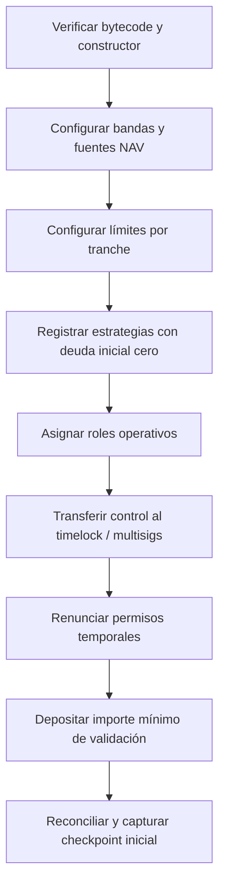

# Despliegue y configuración

## Precondiciones

- Commit revisado, CI verde y binarios construidos con Solidity `0.8.24`.
- RPC y explorador de la red objetivo verificados por dos operadores.
- Activo subyacente revisado: decimales conocidos, sin rebase ni fee-on-transfer.
- Direcciones de multisig y servicios aprobadas por el registro de cambios.
- Límites, heartbeats y escenarios guardados como artefacto versionado.
- Cuenta de despliegue financiada solo para la operación prevista.

## Variables

| Variable | Uso | Regla |
| --- | --- | --- |
| `PRIVATE_KEY` | Firma de despliegue | Secreto efímero; nunca en Git |
| `ARCADIA_ASSET` | Activo de liquidación | Contrato ERC-20 validado |
| `ARCADIA_ADMIN` | Admin inicial | Multisig o dirección de transición |
| `ARCADIA_TREASURY` | Receptor de comisiones | Dirección aprobada |
| `ARCADIA_LOSS_RECEIVER` | Receptor contable de pérdidas | Dirección aprobada |
| `ARCADIA_REDEMPTION_DELAY` | Retardo mínimo de cola | Segundos, `uint64` |
| `ARCADIA_GOVERNANCE_DELAY` | Retardo del timelock | Segundos, mayor que cero |
| `ARCADIA_GOVERNANCE_GRACE` | Ventana de ejecución | Segundos, mayor que cero |

`.env.example` contiene el esquema, no valores de una red.

## Contratos creados

`DeployArcadia.s.sol` despliega vault, oracles de riesgo y NAV, registry de estrategias, parameter
store, cola, reserve ledger, checkpoint registry, scenario engine, timelock, lens y monitor. El
resultado ABI devuelve las direcciones como una estructura `Deployment`.

## Procedimiento

```bash
bash scripts/ci.sh
cp .env.example .env
# completar .env y revisarlo fuera del historial
source .env

forge script script/DeployArcadia.s.sol:DeployArcadia \
  --rpc-url "$RPC_URL" \
  --broadcast \
  --verify
```

Primero debe ejecutarse una simulación sin `--broadcast`. Guarda el JSON de transacciones, las
direcciones previstas y el coste. La difusión requiere que dos operadores comparen el resultado con
la simulación.

## Configuración posterior



Registra explícitamente cada `grantRole`, `revokeRole` y `renounceRole`. No retires el último admin
hasta demostrar que la gobernanza puede programar, ejecutar y cancelar una operación.

## Validaciones posteriores

- El bytecode verificado coincide con el artefacto del commit publicado.
- Las direcciones inmutables de asset y vault son correctas.
- Las tres share tokens pertenecen al vault esperado.
- Los límites de deuda parten de cero o del valor aprobado.
- Las fuentes NAV activas tienen reporter, confianza y heartbeat correctos.
- Timelock aplica delay y grace period.
- Lens y monitor leen el vault desplegado.
- El primer checkpoint verifica el estado actual.
- No quedan roles temporales en cuentas personales.

## Reversión

Los contratos no son actualizables. Una configuración incorrecta se contiene con pausas y retiro de
autoridad; una migración requiere despliegue nuevo, plan de salida, reconciliación por tranche y
aceptación explícita de los usuarios. No se debe improvisar una migración desde scripts de
despliegue.
