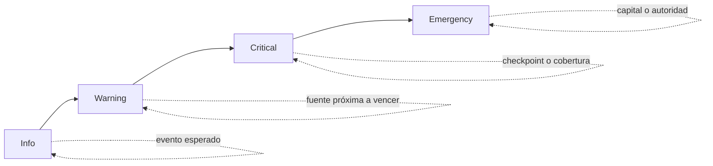

# Observabilidad y reconciliación

## Señales mínimas

| Señal | Fuente | Frecuencia sugerida | Alerta |
| --- | --- | --- | --- |
| Activos contabilizados | `snapshot()` | Cada bloque indexado | Cambio fuera de evento esperado |
| Balance líquido | ERC-20 `balanceOf(vault)` | Cada bloque indexado | Menor que obligación inmediata |
| Cobertura por tranche | `ArcadiaMonitor` | Cada bloque indexado | Bajo warning/critical |
| Frescura NAV | `ArcadiaNavOracle` | Antes de usar precio | Heartbeat vencido |
| Frescura de estrategia | `ArcadiaStrategyRegistry` | Antes de asignar deuda | Reporte ausente o vencido |
| Cola pendiente | `RedemptionQueue` | Continua | Concentración o edad anómala |
| Timelock | eventos `Operation*` | Continua | Operación no registrada internamente |
| Checkpoint | `CheckpointRecorded` | Cada cierre | Digest actual diferente |

## Reconciliación de books

```text
bookTotal = senior.accountedAssets
          + mezzanine.accountedAssets
          + junior.accountedAssets

bookTotal == snapshot.totalAccountedAssets
```

La liquidez no equivale siempre al book: puede existir deuda de estrategias. Por ello se reconcilian
por separado balance del vault, liquid assets de estrategias, estimated assets, pending gain/loss y
deuda total.

## Checkpoints

Cada cierre obtiene dos digests externos:

- `navDigest`: hash del conjunto de observaciones utilizado.
- `configDigest`: hash canónico de roles, límites, fuentes y estrategias.

El keeper ejecuta `capture(navDigest, configDigest)`. Antes de una acción sensible, el operador
puede llamar `requireCurrent(sequence)`. Si el estado cambió, debe crear una nueva reconciliación; no
debe reutilizar la aprobación anterior.

## Eventos indexados

Agrupa eventos en cinco streams:

1. Capital: depósitos, redenciones, harvests y reportes.
2. Configuración: tranches, fees, pausas, bandas y límites.
3. Estrategias: altas, estado, reportes y deuda agregada.
4. Gobernanza: operaciones programadas, canceladas y ejecutadas.
5. Evidencia: observaciones NAV, hashes y checkpoints.

Los indexadores deben usar `(chainId, contract, blockNumber, transactionIndex, logIndex)` como clave
idempotente y tolerar reorganizaciones hasta la profundidad definida para la red.

## Niveles de alerta



- **Info:** cambio esperado y reconciliado.
- **Warning:** degradación sin incumplimiento actual.
- **Critical:** control o invariante no confirmado; detener aumento de riesgo.
- **Emergency:** custodia, capacidad de salida o autoridad en riesgo; ejecutar runbook.

## Panel operativo

Un panel útil muestra simultáneamente:

- activos, shares y tres precios por tranche;
- cobertura y absorción acumulada de pérdidas;
- liquidez del vault y por estrategia;
- NAV, confianza, edad y fuente;
- requests pendientes por edad y tranche;
- pausas, emergency mode y reportes abiertos;
- última operación de timelock;
- secuencia y estado del último checkpoint.

No se debe derivar un estado saludable de una sola métrica. El cierre operativo exige coherencia
entre capital, liquidez, autoridad y frescura de datos.
