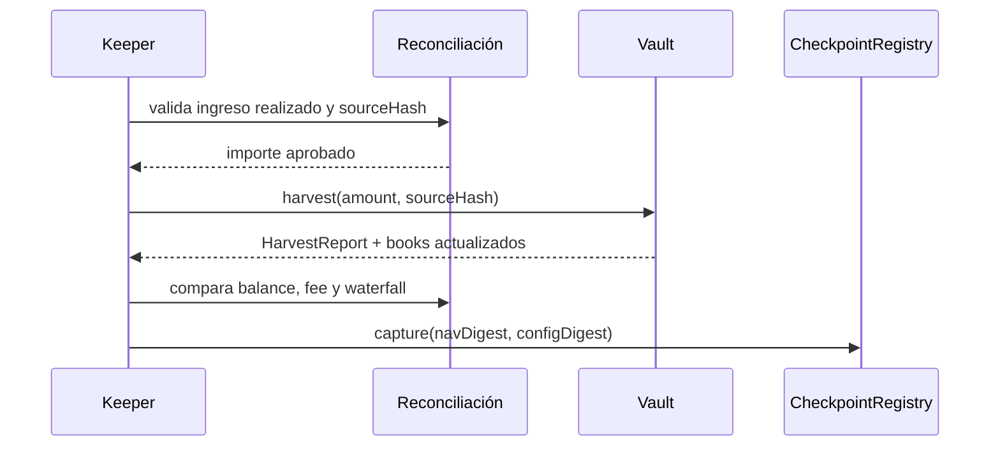

# Runbook de operación

## Matriz de estados

| Señal | Estado | Acción automática | Decisión humana |
| --- | --- | --- | --- |
| Books y balances reconciliados | Normal | Mantener flujos | Ninguna |
| NAV próximo a heartbeat | Degradado | Reducir asignación | Renovar o descartar fuente |
| Estrategia sin reporte fresco | Degradado | Bloquear aumento de deuda | Revisar estrategia |
| Déficit de liquidez proyectado | Advertencia | Activar cola / límites | Ajustar buffer |
| Cobertura bajo umbral crítico | Crítico | Pausar depósitos o salidas selectivas | Comité de riesgo |
| Diferencia de checkpoint | Crítico | Pausar cambios y asignaciones | Reconciliación completa |
| Emergencia declarada | Emergencia | Usar flujo específico | Multisig guardian |

## Apertura diaria

1. Confirmar que la rama `production` y el tag operativo apuntan al commit aprobado.
2. Leer `snapshot()` y comparar `totalAccountedAssets` con la suma de las tres tranches.
3. Verificar balance líquido, deuda, activos estimados y pending gain/loss por estrategia.
4. Ejecutar frescura para cada fuente NAV preferida y reporte activo.
5. Ejecutar escenarios base, adverso y severo con parámetros versionados.
6. Revisar buckets diarios y solicitudes pendientes de la cola.
7. Capturar un checkpoint con los digests de NAV y configuración aprobados.

## Harvest

No se registra rendimiento estimado como realizado. El `sourceHash` debe resolver internamente a
una evidencia inmutable y no contener información sensible.

## Registro y cierre de pérdidas

1. Confirmar que el importe es realizado y que existe liquidez suficiente para el asiento.
2. Versionar el motivo fuera de cadena y obtener su hash.
3. Registrar el importe con una cuenta `REPORTER_ROLE`.
4. Comparar asignación Junior/Mezzanine/Senior con un cálculo independiente.
5. Revisar prices, books, balance y paneles durante el estado pendiente.
6. Cerrar con `KEEPER_ROLE` solo después de la reconciliación.
7. Capturar checkpoint y conservar el identificador del reporte.

No se deben agrupar eventos independientes en un único reporte si ello impide rastrear origen,
fecha o estrategia.

## Cola de redenciones

Una solicitud válida reserva shares disponibles del propietario sin moverlas. El retardo efectivo
es `max(defaultDelay, customDelay)` y el mínimo de activos se verifica al marcar la ejecución.

- Solo el propietario o el vault pueden crear la solicitud.
- Las shares pendientes reducen la capacidad para crear solicitudes adicionales.
- Propietario o guardian pueden cancelar una solicitud activa.
- Solo el vault puede marcarla como ejecutada.
- El ejecutor debe comprobar allowance y balance al procesar la redención real.

## Emergencia

La activación exige una señal verificable y una referencia operativa. Orden recomendado:

1. Pausar el flujo afectado.
2. Suspender aumentos de deuda y fuentes no frescas.
3. Registrar snapshots de vault, estrategias, NAV y configuración.
4. Reconciliar reportes abiertos.
5. Publicar parámetros de salida y usar precio de liquidación.
6. Mantener un registro cronológico de acciones y firmantes.
7. Reabrir únicamente tras escenarios, tests y checkpoint aprobados.

## Cierre diario

El cierre incluye total por tranche, shares, precios, balance líquido, deuda, NAV, reportes abiertos,
solicitudes pendientes, pausas, estado de emergencia y último checkpoint. Cualquier diferencia no
explicada se arrastra como incidente operativo y bloquea el aumento de riesgo.
